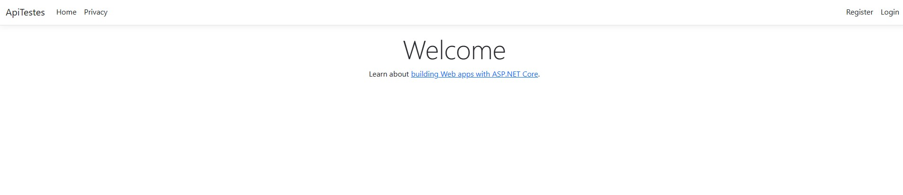
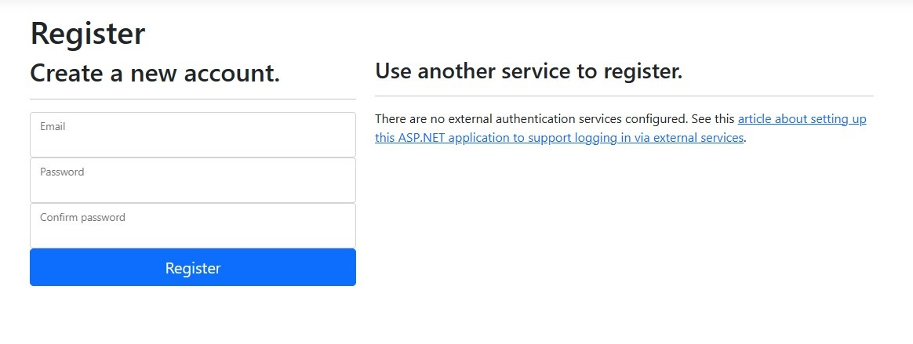

<!-- 

   

 -->

### Tópicos 

- [Descrição do projeto](#descrição-do-projeto)

- [Funcionalidades](#funcionalidades)

- [Ferramentas utilizadas](#ferramentas-utilizadas)

- [Acesso ao projeto](#acesso-ao-projeto)

- [Abrir e rodar o projeto](#abrir-e-rodar-o-projeto)

## Descrição do projeto 

Este projeto foi desenvolvido para começar a usar testes automatizados, especialmente usando o método TDD, e suprir a necessidade de se adequar aos padrões atuais de boas práticas de programação.

Neste primeiro momento, por ser um projeto inicial, não observamos o TDD, fizemos os testes depois para pode entender primeiro como programá-los.
O projeto é composto de 3 camadas:

Apresentação (ApiTestes) em formato MVC

Dados (Data) Class Library

Testes (TestProjectApi) MsTests

* importante observar que é necessário criar um banco local MySql e rodar uma migration, abaixo os dados de conexão usados na aplicação:
"DefaultConnection": "server=localhost;database=ApiTestes;uid=root;pwd=root"
* Se você rodar a migration da aplicação e usar os mesmos dados, não será necessário adaptar o código e nem criar outro usuário:

 

## Funcionalidades

`Tela de Abertura:`

`Tela de Registro de Contas:`
   

   
 

✅ `Funcionalidade 1:` Realizar cadastro de usuário administrador.

✅ `Funcionalidade 2:` Gerador de token de acesso.

✅ `Funcionalidade 3:` Endpoints para listar, alterar, incluir e remover dados.

✅ `Funcionalidade 4:` Testes nos endpoints de listar, adicionar e remover.

 

## Ferramentas utilizadas

<a href="https://www.mysql.com/" target="_blank" rel="noreferrer"> 

## Acesso ao projeto
Você pode [acessar o código fonte do projeto ou baixá-lo](https://github.com/medinasp/TestesApi)   

## Abrir e rodar o projeto
Após baixar o projeto, você pode e abri-lo e trabalhar com `Visual Studio`.
